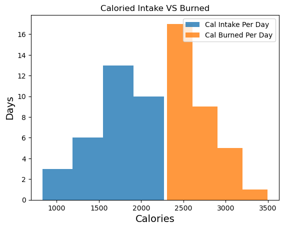
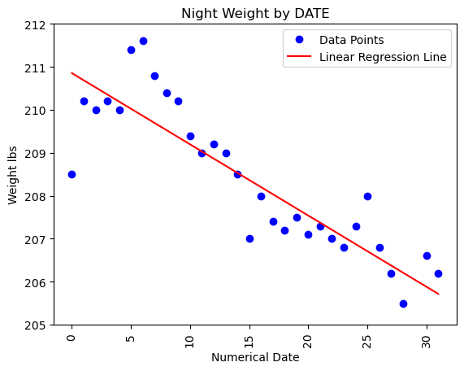
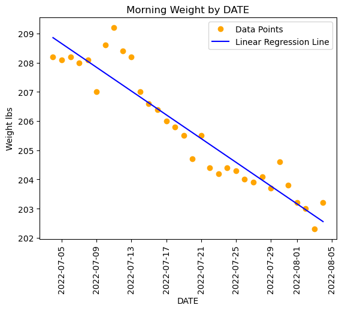
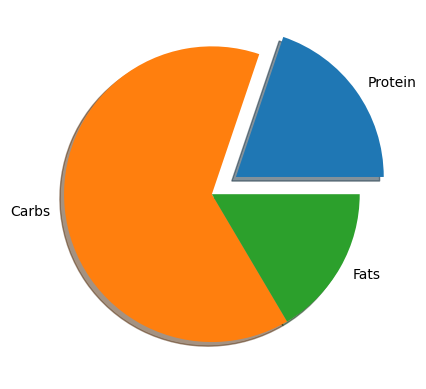
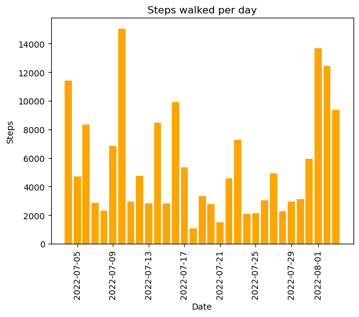

<h3>Jerry Barboza: Health Data Tracked from July 4, 2022</h3>


In this project I will show data about my health I been tracking down and run statistical analysis to find any correlations between the data. This project just conatains a sample from the full dataset since the remaining data I keep it private, however there is still enough data to understand how important it is to track your health where you can help communication with your doctor and improve your health. 


```python
import numpy as np
import pandas as pd
import matplotlib.pyplot as plt

# dataframe for this project
df = pd.read_csv('Health_Data.csv')
df.head(n=10)
```


<div>
<style scoped>
    .dataframe tbody tr th:only-of-type {
        vertical-align: middle;
    }

    .dataframe tbody tr th {
        vertical-align: top;
    }

    .dataframe thead th {
        text-align: right;
    }
</style>
<table border="1" class="dataframe">
  <thead>
    <tr style="text-align: right;">
      <th></th>
      <th>Date</th>
      <th>Fats</th>
      <th>Carbs</th>
      <th>Protein</th>
      <th>Total Calories</th>
      <th>Resting Energy (cal)</th>
      <th>Active Energy (cal)</th>
      <th>Total CAL Burned</th>
      <th>Calories</th>
      <th>Morning Weight</th>
      <th>Night Weight</th>
      <th>Max BPM</th>
      <th>Resting Heart Rate Average</th>
      <th>Walking Heart Rate Average</th>
      <th>Steps</th>
      <th>Blood Pressure SYS (moring)</th>
      <th>Blood Pressure DIA (morning)</th>
      <th>Blood_Pressure_SYS_Night</th>
      <th>Blood_Pressure_DIA_Night</th>
    </tr>
  </thead>
  <tbody>
    <tr>
      <th>0</th>
      <td>Monday, July 4, 2022</td>
      <td>75</td>
      <td>283</td>
      <td>62</td>
      <td>2055</td>
      <td>2215</td>
      <td>652</td>
      <td>2867</td>
      <td>-812</td>
      <td>208.2</td>
      <td>208.5</td>
      <td>133</td>
      <td>80</td>
      <td>115</td>
      <td>11410.0</td>
      <td>NaN</td>
      <td>NaN</td>
      <td>NaN</td>
      <td>NaN</td>
    </tr>
    <tr>
      <th>1</th>
      <td>Tuesday, July 5, 2022</td>
      <td>85</td>
      <td>283</td>
      <td>77</td>
      <td>2205</td>
      <td>2167</td>
      <td>388</td>
      <td>2555</td>
      <td>-350</td>
      <td>208.1</td>
      <td>210.2</td>
      <td>115</td>
      <td>73</td>
      <td>89</td>
      <td>4687.0</td>
      <td>NaN</td>
      <td>NaN</td>
      <td>NaN</td>
      <td>NaN</td>
    </tr>
    <tr>
      <th>2</th>
      <td>Wednesday, July 6, 2022</td>
      <td>53</td>
      <td>239</td>
      <td>59</td>
      <td>1669</td>
      <td>2175</td>
      <td>728</td>
      <td>2903</td>
      <td>-1234</td>
      <td>208.2</td>
      <td>210.0</td>
      <td>172</td>
      <td>77</td>
      <td>113</td>
      <td>8332.0</td>
      <td>NaN</td>
      <td>NaN</td>
      <td>NaN</td>
      <td>NaN</td>
    </tr>
    <tr>
      <th>3</th>
      <td>Thursday, July 7, 2022</td>
      <td>59</td>
      <td>259</td>
      <td>84</td>
      <td>1903</td>
      <td>2097</td>
      <td>367</td>
      <td>2464</td>
      <td>-561</td>
      <td>208.0</td>
      <td>210.2</td>
      <td>135</td>
      <td>79</td>
      <td>128</td>
      <td>2871.0</td>
      <td>NaN</td>
      <td>NaN</td>
      <td>NaN</td>
      <td>NaN</td>
    </tr>
    <tr>
      <th>4</th>
      <td>Friday, July 8, 2022</td>
      <td>70</td>
      <td>330</td>
      <td>80</td>
      <td>2270</td>
      <td>2135</td>
      <td>409</td>
      <td>2544</td>
      <td>-274</td>
      <td>208.1</td>
      <td>210.0</td>
      <td>135</td>
      <td>84</td>
      <td>123</td>
      <td>2317.0</td>
      <td>NaN</td>
      <td>NaN</td>
      <td>NaN</td>
      <td>NaN</td>
    </tr>
    <tr>
      <th>5</th>
      <td>Saturday, July 9, 2022</td>
      <td>50</td>
      <td>300</td>
      <td>70</td>
      <td>1930</td>
      <td>2254</td>
      <td>639</td>
      <td>2893</td>
      <td>-963</td>
      <td>207.0</td>
      <td>211.4</td>
      <td>151</td>
      <td>74</td>
      <td>123</td>
      <td>6849.0</td>
      <td>NaN</td>
      <td>NaN</td>
      <td>NaN</td>
      <td>NaN</td>
    </tr>
    <tr>
      <th>6</th>
      <td>Sunday, July 10, 2022</td>
      <td>70</td>
      <td>330</td>
      <td>80</td>
      <td>2270</td>
      <td>2277</td>
      <td>1221</td>
      <td>3498</td>
      <td>-1228</td>
      <td>208.6</td>
      <td>211.6</td>
      <td>180</td>
      <td>84</td>
      <td>148</td>
      <td>15037.0</td>
      <td>NaN</td>
      <td>NaN</td>
      <td>NaN</td>
      <td>NaN</td>
    </tr>
    <tr>
      <th>7</th>
      <td>Monday, July 11, 2022</td>
      <td>65</td>
      <td>300</td>
      <td>70</td>
      <td>2065</td>
      <td>2188</td>
      <td>439</td>
      <td>2627</td>
      <td>-562</td>
      <td>209.2</td>
      <td>210.8</td>
      <td>150</td>
      <td>71</td>
      <td>113</td>
      <td>2938.0</td>
      <td>NaN</td>
      <td>NaN</td>
      <td>NaN</td>
      <td>NaN</td>
    </tr>
    <tr>
      <th>8</th>
      <td>Tuesday, July 12, 2022</td>
      <td>60</td>
      <td>300</td>
      <td>75</td>
      <td>2040</td>
      <td>2169</td>
      <td>443</td>
      <td>2612</td>
      <td>-572</td>
      <td>208.4</td>
      <td>210.4</td>
      <td>123</td>
      <td>79</td>
      <td>111</td>
      <td>4745.0</td>
      <td>NaN</td>
      <td>NaN</td>
      <td>NaN</td>
      <td>NaN</td>
    </tr>
    <tr>
      <th>9</th>
      <td>Wednesday, July 13, 2022</td>
      <td>50</td>
      <td>230</td>
      <td>50</td>
      <td>1570</td>
      <td>2158</td>
      <td>361</td>
      <td>2519</td>
      <td>-949</td>
      <td>208.2</td>
      <td>210.2</td>
      <td>133</td>
      <td>60</td>
      <td>109</td>
      <td>2832.0</td>
      <td>NaN</td>
      <td>NaN</td>
      <td>NaN</td>
      <td>NaN</td>
    </tr>
  </tbody>
</table>
</div>


<h1> Calories Intake vs Calories Burned </h1>


```python
data1 = df['Total Calories']
data2 = df['Total CAL Burned']
plt.hist(data1, bins=4, alpha=.8, label="Cal Intake Per Day")
plt.hist(data2, bins=4, alpha=.8, label="Cal Burned Per Day")

plt.xlabel("Calories", size=14)
plt.ylabel("Days", size=14)
plt.title("Caloried Intake VS Burned")
plt.legend(loc='upper right')

```


    <matplotlib.legend.Legend at 0x7f85e07b3190>


    

    


```python
print(f"Mean Calories Daily Intake: {np.mean(data1)}")
print(f"Mean Caloried Daily Burned: {np.mean(data2)}")
```

    Mean Calories Daily Intake: 1675.5625
    Mean Caloried Daily Burned: 2669.53125


```python
print(f"Mean Resting Heart Rate: {np.mean(df['Resting Heart Rate Average']):.2f}")
print(f"Mean Walkinng Heart Rate: {np.mean(df['Walking Heart Rate Average']):.2f}")


```

    Mean Resting Heart Rate: 69.19
    Mean Walkinng Heart Rate: 110.06


```python
import matplotlib.pyplot as plt
import numpy as np
import pandas as pd

df['Date'] = pd.to_datetime(df['Date'])

# Create a new column with sequential numerical values
df['Numerical Date'] = range(len(df))

# Extract the date and weight columns
x = df['Numerical Date']
y = df['Night Weight']

# Fit a linear regression model
coefficients = np.polyfit(x, y, 1)
slope, intercept = coefficients

# Calculate the linear regression line
line = slope * x + intercept

# Plot the data points
plt.plot(df['Numerical Date'], y, 'o', color='blue', label='Data Points')

# Plot the linear regression line
plt.plot(x, line, color='red', label='Linear Regression Line')

# Set the y-axis limits
plt.ylim(205, 212)

# Set a title for the plot, x-axis, and y-axis.
plt.title('Night Weight by DATE')
plt.xlabel('Numerical Date')
plt.xticks(rotation=90)
plt.ylabel('Weight lbs')

# Add a legend to the plot
plt.legend()

# Print the linear equation
print(f'Linear Equation: y = {slope:.2f}x + {intercept:.2f}')

plt.show()

```

    Linear Equation: y = -0.17x + 210.85


    

    


```python

df['Date'] = pd.to_datetime(df['Date'])

# Create a new column with sequential numerical values
df['Numerical Date'] = range(len(df))

# Extract the date and "Morning Weight" columns
x = df['Numerical Date']
y = df['Morning Weight']

# Fit a linear regression model
coefficients = np.polyfit(x, y, 1)
slope, intercept = coefficients

# Calculate the linear regression line
line = slope * x + intercept

# Plot the data points
plt.plot(df['Date'], y, 'o', color='orange', label='Data Points')

# Plot the linear regression line
plt.plot(df['Date'], line, color='blue', label='Linear Regression Line')

# Set a title for the plot, x-axis, and y-axis.
plt.title('Morning Weight by DATE')
plt.xlabel('DATE')
plt.xticks(rotation=90)
plt.ylabel('Weight lbs')

# Add a legend to the plot
plt.legend()

# Print the linear equation
print(f'Linear Equation: y = {slope:.2f}x + {intercept:.2f}')

plt.show()

```

    Linear Equation: y = -0.20x + 208.86


    

    


<h3> Correlation Matrix </h3> 

In this matrix, we are able to see any correlations within our dataset. A number of 1 is a perfect correlation, therefore anything closer to 1 means there is a strong correlation between the data. 


```python
data = pd.read_csv('Health_Data.csv', usecols = ['Total Calories','Resting Energy (cal)','Active Energy (cal)','Total CAL Burned',
                'Morning Weight','Night Weight','Resting Heart Rate Average','Walking Heart Rate Average','Steps'])
df = pd.DataFrame(data)

# Calculate the correlation matrix
corr = df.corr()

# Style the correlation matrix
styled_corr = corr.style.format(precision=3).background_gradient(cmap="RdBu", vmin=-1, vmax=1)

styled_corr
```


<style type="text/css">
#T_1f89f_row0_col0, #T_1f89f_row1_col1, #T_1f89f_row2_col2, #T_1f89f_row3_col3, #T_1f89f_row4_col4, #T_1f89f_row5_col5, #T_1f89f_row6_col6, #T_1f89f_row7_col7, #T_1f89f_row8_col8 {
  background-color: #053061;
  color: #f1f1f1;
}
#T_1f89f_row0_col1, #T_1f89f_row1_col0 {
  background-color: #b3d6e8;
  color: #000000;
}
#T_1f89f_row0_col2, #T_1f89f_row1_col6, #T_1f89f_row2_col0, #T_1f89f_row6_col1 {
  background-color: #87beda;
  color: #000000;
}
#T_1f89f_row0_col3, #T_1f89f_row3_col0 {
  background-color: #8ac0db;
  color: #000000;
}
#T_1f89f_row0_col4, #T_1f89f_row3_col6, #T_1f89f_row4_col0, #T_1f89f_row6_col3 {
  background-color: #569fc9;
  color: #f1f1f1;
}
#T_1f89f_row0_col5, #T_1f89f_row5_col0 {
  background-color: #71b0d3;
  color: #f1f1f1;
}
#T_1f89f_row0_col6, #T_1f89f_row6_col0 {
  background-color: #408fc1;
  color: #f1f1f1;
}
#T_1f89f_row0_col7, #T_1f89f_row7_col0 {
  background-color: #8dc2dc;
  color: #000000;
}
#T_1f89f_row0_col8, #T_1f89f_row8_col0 {
  background-color: #98c8e0;
  color: #000000;
}
#T_1f89f_row1_col2, #T_1f89f_row2_col1 {
  background-color: #2e77b5;
  color: #f1f1f1;
}
#T_1f89f_row1_col3, #T_1f89f_row3_col1 {
  background-color: #1c5c9f;
  color: #f1f1f1;
}
#T_1f89f_row1_col4, #T_1f89f_row2_col4, #T_1f89f_row4_col1, #T_1f89f_row4_col2 {
  background-color: #deebf2;
  color: #000000;
}
#T_1f89f_row1_col5, #T_1f89f_row5_col1 {
  background-color: #d5e7f1;
  color: #000000;
}
#T_1f89f_row1_col7, #T_1f89f_row7_col1 {
  background-color: #9bc9e0;
  color: #000000;
}
#T_1f89f_row1_col8, #T_1f89f_row8_col1 {
  background-color: #4c99c6;
  color: #f1f1f1;
}
#T_1f89f_row2_col3, #T_1f89f_row3_col2 {
  background-color: #063264;
  color: #f1f1f1;
}
#T_1f89f_row2_col5, #T_1f89f_row5_col2 {
  background-color: #dae9f2;
  color: #000000;
}
#T_1f89f_row2_col6, #T_1f89f_row6_col2 {
  background-color: #529dc8;
  color: #f1f1f1;
}
#T_1f89f_row2_col7, #T_1f89f_row7_col2 {
  background-color: #3783bb;
  color: #f1f1f1;
}
#T_1f89f_row2_col8, #T_1f89f_row8_col2 {
  background-color: #175290;
  color: #f1f1f1;
}
#T_1f89f_row3_col4, #T_1f89f_row4_col3 {
  background-color: #ddebf2;
  color: #000000;
}
#T_1f89f_row3_col5, #T_1f89f_row5_col3 {
  background-color: #d7e8f1;
  color: #000000;
}
#T_1f89f_row3_col7, #T_1f89f_row7_col3 {
  background-color: #3e8cbf;
  color: #f1f1f1;
}
#T_1f89f_row3_col8, #T_1f89f_row8_col3 {
  background-color: #1b5a9c;
  color: #f1f1f1;
}
#T_1f89f_row4_col5, #T_1f89f_row5_col4 {
  background-color: #124984;
  color: #f1f1f1;
}
#T_1f89f_row4_col6, #T_1f89f_row6_col4 {
  background-color: #5ca3cb;
  color: #f1f1f1;
}
#T_1f89f_row4_col7, #T_1f89f_row7_col4 {
  background-color: #bddbea;
  color: #000000;
}
#T_1f89f_row4_col8, #T_1f89f_row8_col4 {
  background-color: #f7f6f6;
  color: #000000;
}
#T_1f89f_row5_col6, #T_1f89f_row6_col5 {
  background-color: #62a7ce;
  color: #f1f1f1;
}
#T_1f89f_row5_col7, #T_1f89f_row7_col5 {
  background-color: #a5cee3;
  color: #000000;
}
#T_1f89f_row5_col8, #T_1f89f_row8_col5 {
  background-color: #f8f2ef;
  color: #000000;
}
#T_1f89f_row6_col7, #T_1f89f_row7_col6 {
  background-color: #3c8abe;
  color: #f1f1f1;
}
#T_1f89f_row6_col8, #T_1f89f_row8_col6 {
  background-color: #75b2d4;
  color: #f1f1f1;
}
#T_1f89f_row7_col8, #T_1f89f_row8_col7 {
  background-color: #78b4d5;
  color: #000000;
}
</style>
<table id="T_1f89f">
  <thead>
    <tr>
      <th class="blank level0" >&nbsp;</th>
      <th id="T_1f89f_level0_col0" class="col_heading level0 col0" >Total Calories</th>
      <th id="T_1f89f_level0_col1" class="col_heading level0 col1" >Resting Energy (cal)</th>
      <th id="T_1f89f_level0_col2" class="col_heading level0 col2" >Active Energy (cal)</th>
      <th id="T_1f89f_level0_col3" class="col_heading level0 col3" >Total CAL Burned</th>
      <th id="T_1f89f_level0_col4" class="col_heading level0 col4" >Morning Weight</th>
      <th id="T_1f89f_level0_col5" class="col_heading level0 col5" >Night Weight</th>
      <th id="T_1f89f_level0_col6" class="col_heading level0 col6" >Resting Heart Rate Average</th>
      <th id="T_1f89f_level0_col7" class="col_heading level0 col7" >Walking Heart Rate Average</th>
      <th id="T_1f89f_level0_col8" class="col_heading level0 col8" >Steps</th>
    </tr>
  </thead>
  <tbody>
    <tr>
      <th id="T_1f89f_level0_row0" class="row_heading level0 row0" >Total Calories</th>
      <td id="T_1f89f_row0_col0" class="data row0 col0" >1.000</td>
      <td id="T_1f89f_row0_col1" class="data row0 col1" >0.290</td>
      <td id="T_1f89f_row0_col2" class="data row0 col2" >0.426</td>
      <td id="T_1f89f_row0_col3" class="data row0 col3" >0.416</td>
      <td id="T_1f89f_row0_col4" class="data row0 col4" >0.549</td>
      <td id="T_1f89f_row0_col5" class="data row0 col5" >0.483</td>
      <td id="T_1f89f_row0_col6" class="data row0 col6" >0.613</td>
      <td id="T_1f89f_row0_col7" class="data row0 col7" >0.409</td>
      <td id="T_1f89f_row0_col8" class="data row0 col8" >0.380</td>
    </tr>
    <tr>
      <th id="T_1f89f_level0_row1" class="row_heading level0 row1" >Resting Energy (cal)</th>
      <td id="T_1f89f_row1_col0" class="data row1 col0" >0.290</td>
      <td id="T_1f89f_row1_col1" class="data row1 col1" >1.000</td>
      <td id="T_1f89f_row1_col2" class="data row1 col2" >0.724</td>
      <td id="T_1f89f_row1_col3" class="data row1 col3" >0.829</td>
      <td id="T_1f89f_row1_col4" class="data row1 col4" >0.131</td>
      <td id="T_1f89f_row1_col5" class="data row1 col5" >0.179</td>
      <td id="T_1f89f_row1_col6" class="data row1 col6" >0.423</td>
      <td id="T_1f89f_row1_col7" class="data row1 col7" >0.371</td>
      <td id="T_1f89f_row1_col8" class="data row1 col8" >0.577</td>
    </tr>
    <tr>
      <th id="T_1f89f_level0_row2" class="row_heading level0 row2" >Active Energy (cal)</th>
      <td id="T_1f89f_row2_col0" class="data row2 col0" >0.426</td>
      <td id="T_1f89f_row2_col1" class="data row2 col1" >0.724</td>
      <td id="T_1f89f_row2_col2" class="data row2 col2" >1.000</td>
      <td id="T_1f89f_row2_col3" class="data row2 col3" >0.986</td>
      <td id="T_1f89f_row2_col4" class="data row2 col4" >0.130</td>
      <td id="T_1f89f_row2_col5" class="data row2 col5" >0.150</td>
      <td id="T_1f89f_row2_col6" class="data row2 col6" >0.555</td>
      <td id="T_1f89f_row2_col7" class="data row2 col7" >0.666</td>
      <td id="T_1f89f_row2_col8" class="data row2 col8" >0.871</td>
    </tr>
    <tr>
      <th id="T_1f89f_level0_row3" class="row_heading level0 row3" >Total CAL Burned</th>
      <td id="T_1f89f_row3_col0" class="data row3 col0" >0.416</td>
      <td id="T_1f89f_row3_col1" class="data row3 col1" >0.829</td>
      <td id="T_1f89f_row3_col2" class="data row3 col2" >0.986</td>
      <td id="T_1f89f_row3_col3" class="data row3 col3" >1.000</td>
      <td id="T_1f89f_row3_col4" class="data row3 col4" >0.137</td>
      <td id="T_1f89f_row3_col5" class="data row3 col5" >0.165</td>
      <td id="T_1f89f_row3_col6" class="data row3 col6" >0.553</td>
      <td id="T_1f89f_row3_col7" class="data row3 col7" >0.630</td>
      <td id="T_1f89f_row3_col8" class="data row3 col8" >0.840</td>
    </tr>
    <tr>
      <th id="T_1f89f_level0_row4" class="row_heading level0 row4" >Morning Weight</th>
      <td id="T_1f89f_row4_col0" class="data row4 col0" >0.549</td>
      <td id="T_1f89f_row4_col1" class="data row4 col1" >0.131</td>
      <td id="T_1f89f_row4_col2" class="data row4 col2" >0.130</td>
      <td id="T_1f89f_row4_col3" class="data row4 col3" >0.137</td>
      <td id="T_1f89f_row4_col4" class="data row4 col4" >1.000</td>
      <td id="T_1f89f_row4_col5" class="data row4 col5" >0.906</td>
      <td id="T_1f89f_row4_col6" class="data row4 col6" >0.538</td>
      <td id="T_1f89f_row4_col7" class="data row4 col7" >0.259</td>
      <td id="T_1f89f_row4_col8" class="data row4 col8" >-0.005</td>
    </tr>
    <tr>
      <th id="T_1f89f_level0_row5" class="row_heading level0 row5" >Night Weight</th>
      <td id="T_1f89f_row5_col0" class="data row5 col0" >0.483</td>
      <td id="T_1f89f_row5_col1" class="data row5 col1" >0.179</td>
      <td id="T_1f89f_row5_col2" class="data row5 col2" >0.150</td>
      <td id="T_1f89f_row5_col3" class="data row5 col3" >0.165</td>
      <td id="T_1f89f_row5_col4" class="data row5 col4" >0.906</td>
      <td id="T_1f89f_row5_col5" class="data row5 col5" >1.000</td>
      <td id="T_1f89f_row5_col6" class="data row5 col6" >0.523</td>
      <td id="T_1f89f_row5_col7" class="data row5 col7" >0.338</td>
      <td id="T_1f89f_row5_col8" class="data row5 col8" >-0.038</td>
    </tr>
    <tr>
      <th id="T_1f89f_level0_row6" class="row_heading level0 row6" >Resting Heart Rate Average</th>
      <td id="T_1f89f_row6_col0" class="data row6 col0" >0.613</td>
      <td id="T_1f89f_row6_col1" class="data row6 col1" >0.423</td>
      <td id="T_1f89f_row6_col2" class="data row6 col2" >0.555</td>
      <td id="T_1f89f_row6_col3" class="data row6 col3" >0.553</td>
      <td id="T_1f89f_row6_col4" class="data row6 col4" >0.538</td>
      <td id="T_1f89f_row6_col5" class="data row6 col5" >0.523</td>
      <td id="T_1f89f_row6_col6" class="data row6 col6" >1.000</td>
      <td id="T_1f89f_row6_col7" class="data row6 col7" >0.640</td>
      <td id="T_1f89f_row6_col8" class="data row6 col8" >0.469</td>
    </tr>
    <tr>
      <th id="T_1f89f_level0_row7" class="row_heading level0 row7" >Walking Heart Rate Average</th>
      <td id="T_1f89f_row7_col0" class="data row7 col0" >0.409</td>
      <td id="T_1f89f_row7_col1" class="data row7 col1" >0.371</td>
      <td id="T_1f89f_row7_col2" class="data row7 col2" >0.666</td>
      <td id="T_1f89f_row7_col3" class="data row7 col3" >0.630</td>
      <td id="T_1f89f_row7_col4" class="data row7 col4" >0.259</td>
      <td id="T_1f89f_row7_col5" class="data row7 col5" >0.338</td>
      <td id="T_1f89f_row7_col6" class="data row7 col6" >0.640</td>
      <td id="T_1f89f_row7_col7" class="data row7 col7" >1.000</td>
      <td id="T_1f89f_row7_col8" class="data row7 col8" >0.461</td>
    </tr>
    <tr>
      <th id="T_1f89f_level0_row8" class="row_heading level0 row8" >Steps</th>
      <td id="T_1f89f_row8_col0" class="data row8 col0" >0.380</td>
      <td id="T_1f89f_row8_col1" class="data row8 col1" >0.577</td>
      <td id="T_1f89f_row8_col2" class="data row8 col2" >0.871</td>
      <td id="T_1f89f_row8_col3" class="data row8 col3" >0.840</td>
      <td id="T_1f89f_row8_col4" class="data row8 col4" >-0.005</td>
      <td id="T_1f89f_row8_col5" class="data row8 col5" >-0.038</td>
      <td id="T_1f89f_row8_col6" class="data row8 col6" >0.469</td>
      <td id="T_1f89f_row8_col7" class="data row8 col7" >0.461</td>
      <td id="T_1f89f_row8_col8" class="data row8 col8" >1.000</td>
    </tr>
  </tbody>
</table>


<h1> MACROS: Fats, Carbs and Protein </h1>
<br> 
<br>


 <p style="font-size: 15px">The Recommended Dietary Allowance (RDA) for protein is a modest 0.8 grams of protein per kilogram of body weight or 0.36 grams of protein per pound of body weight. According to Harvard Health, if your goal is to gain msucle then you should be consuming at least 50% more (1.2+ grams per Kilogram). Since we break down muscle fibers when working out, your body needs a higher intake of protein to recover and get them bigger. <br><br> The main source of protein I am consuming is Soy, milk and eggs since I am vegetarian I need to find my source of protein from foods that are not meat. 
    </p>


```python
import matplotlib.pyplot as plt
import numpy as np

fats = np.mean(df['Fats'])
carbs = np.mean(df['Carbs'])
protein = np.mean(df['Protein'])
y = np.array([protein, carbs, fats])
mylabels = ["Protein", "Carbs", "Fats"]
myexplode = [0.2, 0, 0]

plt.pie(y, labels = mylabels, explode = myexplode, shadow = True)
plt.show() 

print(f"Mean Protein Intake per day: {np.mean(df['Protein']):.2f} grams")
print(f"Mean Carbs Intake per day: {np.mean(df['Carbs']):.2f} grams")
print(f"Mean Fats Intake per day: {np.mean(df['Fats']):.2f} grams")
```


    

    


    Mean Protein Intake per day: 68.78 grams
    Mean Carbs Intake per day: 221.16 grams
    Mean Fats Intake per day: 57.31 grams


 


```python

date = df['Date']
steps = df['Steps']

# Create a bar chart
plt.bar(date, steps, color='Orange')

# Set a title for the plot, x-axis, and y-axis.
plt.title('Steps walked per day')
plt.xlabel('Date')
plt.xticks(rotation=90)
plt.ylabel('Steps')

# Show the plot
plt.show()

# Calculate and print the mean steps
mean_steps = np.mean(steps)
print(f"Mean Steps Walked per day: {mean_steps:.2f}")

```


    

    


    Mean Steps Walked per day: 5513.90


```python

```


```python

```


```python

```


```python

```
